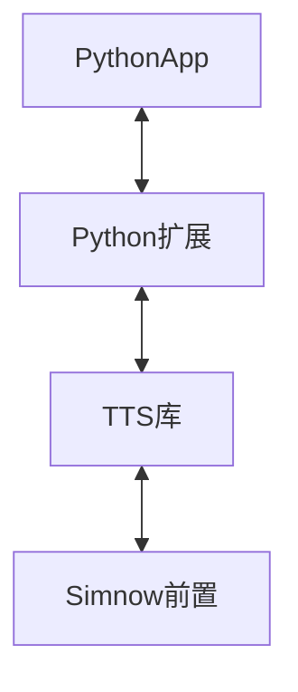

<h1 align="center">openctp-tts</h1>

<p align="center">     
    <a href="#" target="_blank">
        
    </a>       
    <a href="#">         
          
    </a>        
</p>

<p align="center">  
    <a href="https://pypi.org/project/openctp-tts" target="_blank">                                    
                       
    </a> 
    <a href="#">     
                  
    </a> 
    <a href="https://github.com/Jedore/openctp-tts-python/actions" target="_blank">                                                      
                                 
    </a> 
    <a href="https://github.com/Jedore/openctp-tts-python/blob/main/LICENSE" target="_blank">                                                               
                                      
    </a> 
</p>

<p align="center">          
    :rocket:<em>以 Python 的方式，简化对接 TTS 的过程，节省精力，快速上手</em>  
</p>

-----

## 安装:hammer_and_wrench:

```shell
# pip install openctp-tts==<ctpapi version>
pip install openctp-tts==6.3.15
pip install openctp-tts==6.6.7
```

## 代码示例:man_technologist:

```python
from openctp_tts import mdapi, tdapi

md_api = mdapi.CThostFtdcMdApi.CreateFtdcMdApi("market")
td_api = tdapi.CThostFtdcTraderApi.CreateFtdcTraderApi('user_id')
```

- 行情 [demo](demo/mdapi.py)
- 交易 [demo](demo/tdapi.py)

## 功能:full_moon_with_face:

- 支持多版本 TTS
    - 6.3.15_20190220
    - 6.3.19_P1_20200106
    - 6.5.1_20200908
    - 6.6.1_P1_20210406
    - 6.6.7_20220613
    - 6.6.9_20220920
- 支持多版本 Python (3.7 ~ 3.11)
- 支持多平台
    - Windows
    - Linux
    - Macos

## 核心逻辑:art:

利用 [SWIG](https://www.swig.org/)及 TTS 库生成Python扩展库



## 更多信息:page_facing_up:

- [openctp](https://github.com/openctp/openctp)
- QQ交流群

    
