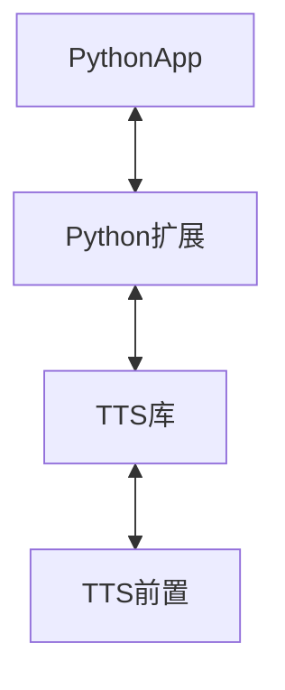

<p align="center">     
    <a href="#" target="_blank">
        
    </a>       
    <a href="#">         
          
    </a>        
    <a href="#">     
                  
    </a> 
</p>

<p align="center">               
    <a href="https://pypi.org/project/openctp-tts-6315" target="_blank">                  
             
    </a>     
    <a href="https://pypi.org/project/openctp-tts-6319" target="_blank">                           
                  
    </a>
    <a href="https://pypi.org/project/openctp-tts-651" target="_blank">                                    
                       
    </a> 
</p>
<p align="center">  
    <a href="https://pypi.org/project/openctp-tts-661" target="_blank">                                             
                            
    </a> 
    <a href="https://pypi.org/project/openctp-tts-667" target="_blank">                                             
                            
    </a> 
    <a href="https://pypi.org/project/openctp-tts-669" target="_blank">                                             
                            
    </a> 
</p>

<p align="center">  
    <a href="https://github.com/Jedore/openctp-tts-python/actions" target="_blank">                                                      
                                 
    </a> 
    <a href="https://github.com/Jedore/openctp-tts-python/blob/main/LICENSE" target="_blank">                                                               
                                      
    </a> 
</p>

<p align="center">          
    <em>:rocket:以 Python 的方式，简化对接 TTS 的过程，节省精力，快速上手</em>  
</p>

-----

## 项目说明:golf:
openctp TTS 提供了稳定的7x24模拟交易平台, 完全兼容上期技术官方CTPAPI接口，同样也是 C++ 版本。本项目提供了Python库，用于使用Python接入TTS系统。
使用方法同[openctp-ctp-python](https://github.com/Jedore/openctp-ctp-python)

限于精力有限，本项目只是进行了 Python版TTS 的打包上传及简单的连接测试，正式使用前请一定进行充分的测试。

## 安装:hammer_and_wrench:

```shell
# pip install openctp-tts-<ctp version>
pip install openctp-tts-6319
pip install openctp-tts-667
```

## 代码示例:man_technologist:

```python
from openctp_tts_667 import mdapi, tdapi

md_api = mdapi.CThostFtdcMdApi.CreateFtdcMdApi("market")
td_api = tdapi.CThostFtdcTraderApi.CreateFtdcTraderApi('user_id')
```

- 行情 [demo](demo/mdapi.py)
- 交易 [demo](demo/tdapi.py)

## 功能:zap:

- 支持多版本 TTS
    - 6.3.15_20190220
    - 6.3.19_P1_20200106
    - 6.5.1_20200908
    - 6.6.1_P1_20210406
    - 6.6.7_20220304
    - 6.6.9_20220920
- 支持多版本 Python (3.7 ~ 3.11)
- 支持多平台
    - Windows
    - Linux

## 核心:art:

利用 [SWIG](https://www.swig.org/)及 TTS 库生成Python扩展库



## 更多信息:page_facing_up:

- [openctp](https://github.com/openctp/openctp)
- QQ交流群 127235179
